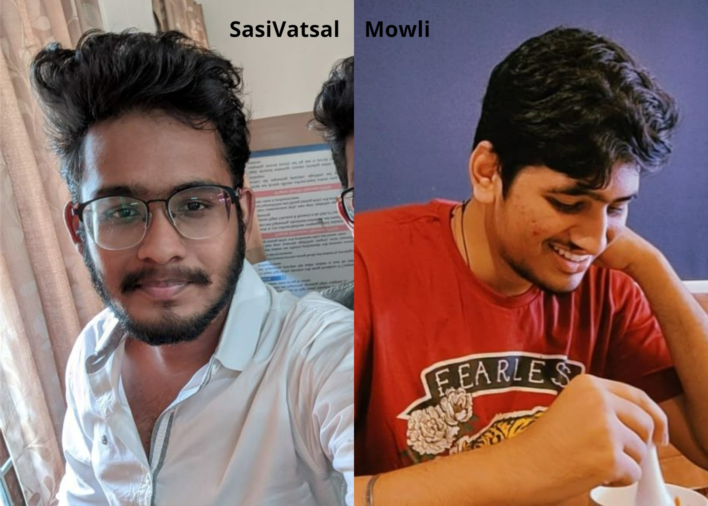

<p align="center"></p>
<h1 align="center">Learn Object Oriented Programming With us 👨🏻‍💻</h1>

#### Hey there buddy!, you have come to the right place to brush up you're skills in objects oriented programming, with the provided study material, numerous examples and notebook assignments , you can be pretty confident about OOP concepts by the end of you're learning jouney in this repo. Start you're OOP coding journey from the link provied below.
<h3 align="center">Visit link --> <a href='https://sasivatsal7122.github.io/OOP-web-hosting/'>Learn-Object_Oriented_programming-with-us</a></h3></p>

#### This paticular repo contains everything you need for learning,understanding,applying and practicing OOP concepts. Visit the website, there you can learn Topic Wise.

#### There is a detailed professional notes all core topics in OOP , click on the topic you wanna know about and start learning and exploring.

### What makes this website unique?
- This particular website is one of it's kind and purely dedicated to OOP concepts with an appealing and pleasing look to work with.
- There are two modes FOCUS and NORMAl, you can toggle b/w the modes based on you're comfort.
- Every topic is xplainded in-detail with clear cut examples.
&nbsp;&nbsp;&nbsp;&nbsp;&nbsp;&nbsp;&nbsp;&nbsp;&nbsp;&nbsp;
<h1 align="center">Authors🖊️💻</h1>
<p align="center"></p>

- ### UI/UX, Introduction, Class-Objects, Inheritance designed and authored by --> <a href='https://github.com/sasivatsal7122'>SasiVatsal</a>
- ### Polymorphism, Encapsulation, Abstraction authored by --> <a href='https://github.com/SaiMowli'>Mowli</a>

<h3 align="center">Visit link --> <a href='https://sasivatsal7122.github.io/OOP-web-hosting/'>Learn-Object_Oriented_programming-with-us</a></h3></p>

### Note:
- Jupyter/kaggle assignments will be added soon.
- Code sources will be added soon.
- Detailed Road-map, other useful resouces for OOP and python will be added soon.
- If you want to contribute feel free to Fork the repo ( • ∀•)–Ψ.

#### And i just wanna thank <a href='https://github.com/SaiMowli'>Mowli</a> for taking part and making this initiative successful, this so far the best ```  Web-Dev & python project  ``` i've done till date (30-01-2022) and also i would like to mention feel free to copy any of the examples, assignments, codes, material if you like ,coz remember... 
### “Copy-and-Paste was programmed by programmers for programmers actually.” 😂. that beign said....
## Happy Learning, Happy coding!....Peace✌️. 
